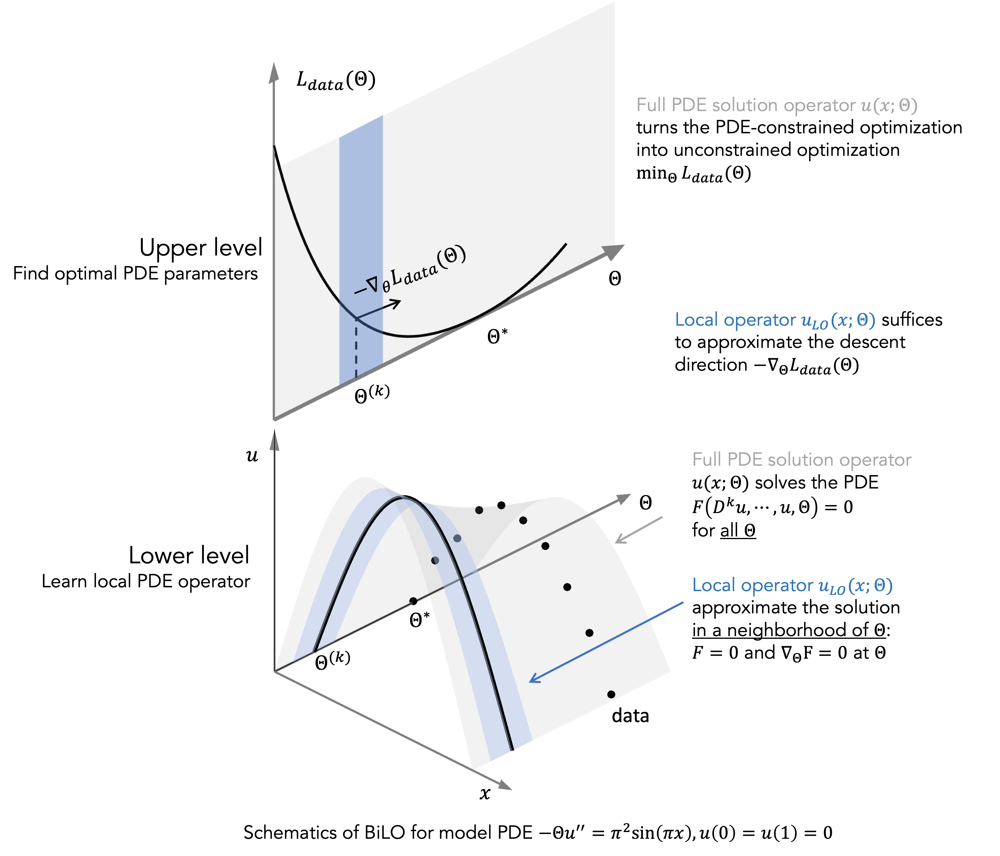

# BiLO: Bilevel Local Operator Learning for PDE Inverse Problems

This repository contains the code for the paper "[BiLO: Bilevel Local Operator Learning for PDE Inverse Problems](https://arxiv.org/abs/2404.17789)"




<!--  -->


## Tutorial
See the [tutorial](tutorial.ipynb) for example of solving inverse problem using BiLO.

## Citing
If you use BiLO, please cite the following paper:

```bibtex
@misc{zhang2024bilo,
      title={BiLO: Bilevel Local Operator Learning for PDE inverse problems}, 
      author={Ray Zirui Zhang and Xiaohui Xie and John Lowengrub},
      year={2024},
      eprint={2404.17789},
      archivePrefix={arXiv},
      primaryClass={cs.LG}
}
```

## Experiments

To run the experiments in the paper, use the following command:
```python
python ExpRunner.py test [--dryrun]
```

Set `test` to be `fk` for Fisher-KPP equation example,
`varpoi` for variable Poisson equation example,
`heat` for Heat equation example,
`ode` for nonlinear ODE  example.
`fkop` for Fisher-KPP equation example with DeepONet.
`darcy` for Darcy flow equation,
`varpoiop` for Variable Poisson equation example with DeepONet.

To see the commands that will be run, use the `--dryrun` flag.

The experiments are managed by mlflow. Set the path in `config.py`.

## Dataset
The pretrain datasets, which are numerical solutions generated by Matlab, can be found [here](https://drive.google.com/drive/folders/1_PF3SibVj25a_TAqJz7FBh74dW4nQV9w?usp=sharing). 
